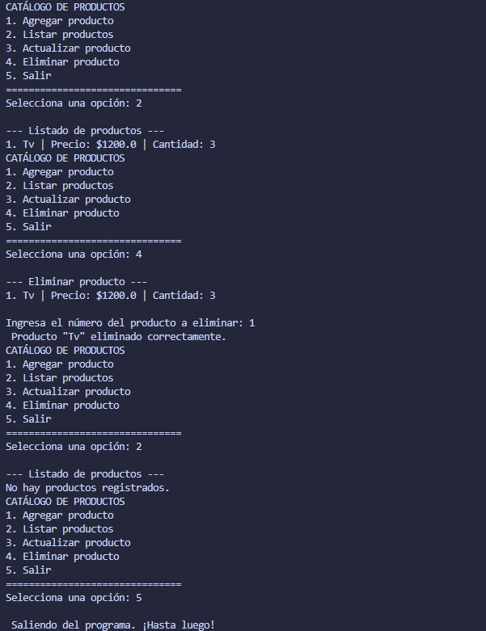

# Taller 1: CRUD Catálogo de Productos en Dart

---

## 📋 Información del Aprendiz

| Dato | Valor |
|------|-------|
| **Nombre** | Vicente Ríos |
| **Número de Ficha** | 3256538 |
| **Programa de Formación** | Análisis y Desarrollo de Software (ADSO) |
| **Institución** | SENA |

---

## 📝 Descripción del Proyecto

Este proyecto es una **aplicación CRUD de consola** desarrollada en **Dart** que permite gestionar un catálogo de productos de una tienda virtual. Los usuarios pueden crear, consultar, actualizar y eliminar productos de forma interactiva, usando un menú en línea de comandos con validaciones integradas.

El programa demuestra el dominio de conceptos fundamentales de Dart como listas, mapas, ciclos de control y estructuras de decisión (`switch-case`), aplicados a un escenario de negocio real: la gestión de inventario de una tienda.

---

## 🎯 Objetivo de la Actividad

Desarrollar una aplicación funcional de gestión de catálogo que:

1. Implemente un **menú interactivo** con opciones de CRUD (Crear, Leer, Actualizar, Eliminar).
2. Utilice **estructuras de datos** adecuadas (listas y mapas) para almacenar productos.
3. Aplique **validaciones robustas** para entradas de usuario (textos no vacíos, números válidos, rangos correctos).
4. Permita **edición parcial** de productos (actualizar solo los campos necesarios).
5. Siga buenas prácticas de **control de versiones** con Gitflow y commits semanticos por funcionalidad.
6. Produzca código **simple, legible y sin funciones auxiliares externas** (todo en `main()`).

---

## 📚 Temas Trabajados

### Conceptos de Dart

- **Listas dinámicas**: `List<Map<String, dynamic>>` para almacenar múltiples productos.
- **Mapas/Diccionarios**: `Map<String, dynamic>` para representar los atributos de cada producto.
- **Ciclos de control**: `while (true)` para mantener el menú activo en bucle.
- **Estructuras de decisión**: `switch-case` para enrutar opciones del menú.
- **Entrada/Salida de consola**: `stdin.readLineSync()` y `stdout.write()` para interacción con el usuario.
- **Validación de tipos**: `double.tryParse()` e `int.tryParse()` para convertir y validar entradas.
- **Manejo de nulabilidad**: Verificación de valores nulos y validaciones de rango.

### Buenas Prácticas de Desarrollo

- **Validación de entradas**: Rechazo de nombres vacíos, precios negativos, cantidades inválidas, índices fuera de rango.
- **Interfaz de usuario**: Menús claros, mensajes de error informativos, confirmaciones visuales (emojis para mejor UX).
- **Control de versiones**: Sugerencia de flujo Gitflow con ramas `feature/*`, `develop` y `main`, con commits semánticos.

### Funcionalidades CRUD

- **Create (Agregar)**: Registro de nuevos productos con validación.
- **Read (Listar)**: Consulta de todos los productos con formato legible.
- **Update (Actualizar)**: Modificación de campos individuales preservando datos existentes.
- **Delete (Eliminar)**: Eliminación de productos con confirmación de índice válido.

---

## ⚡ Instrucciones para Ejecutar el Programa

### Requisitos

- **Dart SDK** versión 2.12 o superior. [Descargar aquí](https://dart.dev/get-dart)

### Pasos

1. **Clona o descarga** el archivo `main.dart` en tu máquina local.

2. **Abre una terminal** en el directorio del proyecto.

3. **Ejecuta el programa**:
   ```bash
   dart main.dart
   ```

4. **Interactúa con el menú**: Selecciona una opción (1-5) y sigue las instrucciones en pantalla.

### Ejemplo de Uso

```
===============================
   CATÁLOGO DE PRODUCTOS
===============================
1. Agregar producto
2. Listar productos
3. Actualizar producto
4. Eliminar producto
5. Salir
===============================
Selecciona una opción: 1

--- Agregar nuevo producto ---
Nombre del producto: Laptop
Precio: 1500.50
Cantidad disponible: 10
✅ Producto "Laptop" agregado correctamente.

[Menú vuelve a aparecer]
```

---

## 📸 Evidencia de Ejecución




